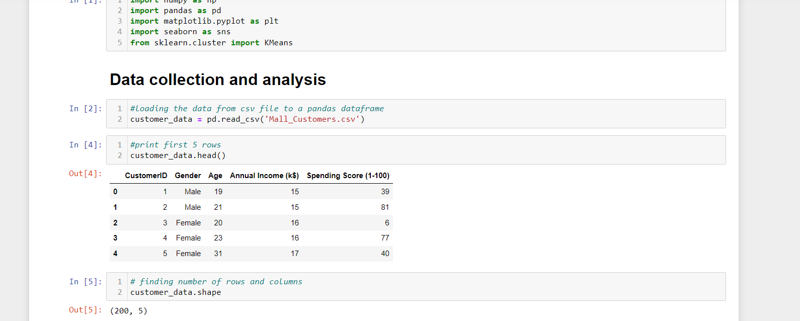
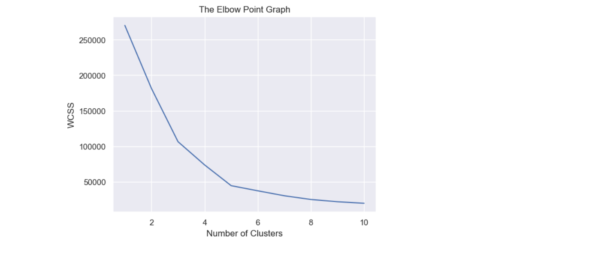
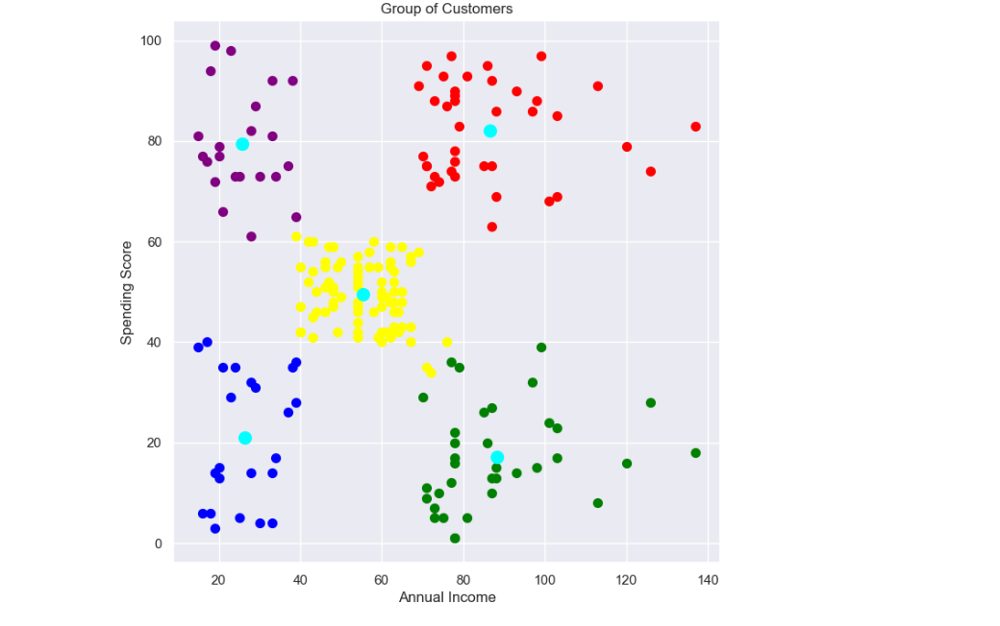

# Customer Segmentation

Customer segmentation is a critical task in marketing and business analysis, which involves dividing a customer base into distinct groups or segments based on their shared characteristics and behaviors. This project aims to use Python to perform customer segmentation on a dataset, enabling businesses to understand their customers better and make data-driven decisions for targeted marketing strategies.

## Project Steps : 
### 1. Data Collection and Preprocessing:
In the initial phase, I have collected a comprehensive dataset from various sources, including transaction records, customer surveys, and demographic information. The data was carefully cleansed and preprocessed to handle missing values, outliers, and inconsistencies. This step ensures the data's integrity and prepares it for further analysis.

### 2. Exploratory Data Analysis (EDA):
Through exploratory data analysis, I have delved into the dataset to uncover patterns, trends, and relationships among different customer attributes. Visualization techniques using Python libraries such as Matplotlib and Seaborn helped us gain valuable insights into customer behaviors and preferences.

### 3.Feature Engineering: 
To enhance the segmentation process, we engineered new features and transformed existing ones to better represent customer interactions and behaviors. Feature scaling and normalization techniques were applied to ensure all features contributed equally to the segmentation model.

### 4. K-Means Clustering:
After evaluating different approaches, I have found that K-Means clustering provided the most effective segmentation results. The algorithm efficiently grouped customers into distinct clusters based on their similarities, helping us reveal hidden patterns and unique characteristics within the customer base.

#### Alse called cut-off point graph
We will see elbow points, elbow-points are the points at which there is sharp drop in values. Here, **3** & **5** are the two elbow points. 
 - We will choose **5** for number of clusters for this dataset as there is no sharp drop after this.

### 5. Visualization and Reporting:
To present the findings in a compelling and understandable manner, I have created interactive visualizations using Plotly or Dash. This allowed stakeholders and decision-makers to explore the customer segments and insights intuitively.

## What we can get from this ?

- How malls can increase their sales
  *  By bringing membership cards for people who are not buying too much, Discounts, offers,etc..

